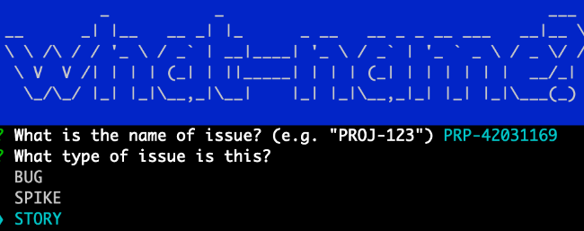

# what-name-branch

Hello reader! How many times has this happened to you? You're out walking your dog and your boss jumps out of a bush.

> Boss: "We've got a production bug you have to fix right now!"

You know the fix, but what to call it? Do you include the issue title? Will a short description be enough?

```shell
myCatsBreathSmells-like-cat-food
```

<p align="center">
  
</p>

There's got to be a better way!

A much _saner_ approach is to just be opinionated and specific, which is what I've done!

## Table of Contents

- [Opinionated Branch Names](#opinionated-branch-names)
- [Installation](#installation)
- [Usage](#usage)

## Opinionated Branch Names

My favored approach to branch naming is three pieces, directly related to the issue (or whatever your software management suite calls it):

- `name`: what is the id used by your software management tool (aka Jira, etc)?
- `type`: of issue. Is this a bug, story, or a spike?
- `description`: the description from the title of the issue.

Simply put:


I would name the branch: `story/PRP-42031169/i-needed-an-issue-for-a-screenshot-so-here-it-be`.

This tells me that it's a _story_, references the ID (in this case, the Jira one), and includes enough of a description where I can tell what I or someone else was doing.

In contrast to a branch name like: `PRP-42031169` or even `PRP-42031169/screenshot` it gives me a bit more context, especially if the branch hangs around for a bit (e.g. I am switching between branches, for some reason), and even helps after the branch is closed and merged.

This reduces "side trips" to Jira (in this case) to try and suss out just what the heck-poop you were doing with branch `fix-things` or whatever.

[Table of Contents](#table-of-contents)

## Installation

Via `npm`:

```shell
npm install -g @ezweave/what-name-branch
```

Via `yarn`:

```shell
yarn global add @ezweave/what-name-branch
```

[Table of Contents](#table-of-contents)

## Usage

```shell
name-branch
```

This will start asking you three short questions.

First, get the name/id from your software management tool (Jira, in our case):


Second, select your issue type:



Third, enter the description. `name-branch` will strip out unsafe characters and replace them with `-`, so go nuts:


It will ask you if you want to create this branch now (assuming you are in the right directory, etc). It wil default to yes.

Now you have a branch name:


Tada! Now you can get back to arguing about important things like `vim` vs `emacs`.

[Table of Contents](#table-of-contents)
